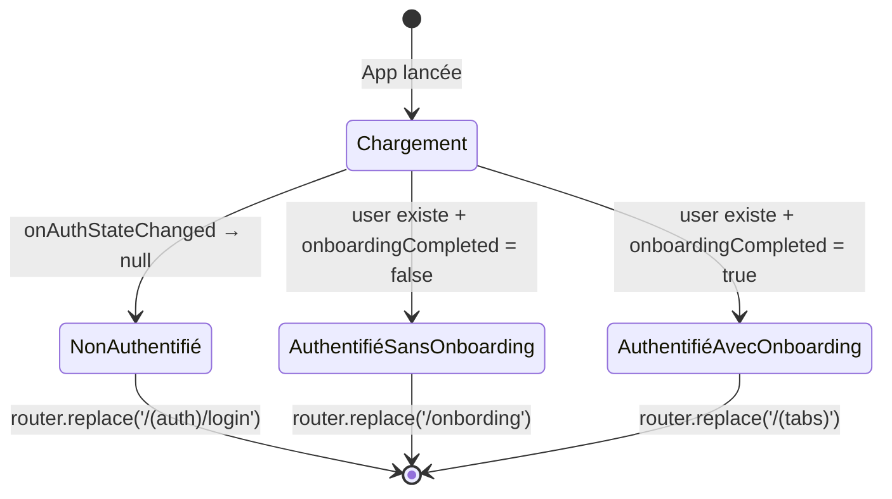

# 01 — Flux d'Authentification

Fichiers : `app/(auth)/login.tsx`, `app/(auth)/register.tsx`, `app/(auth)/forgot-password.tsx`, `app/schema/auth.ts`, `app/utils/auth-errors.ts`, `components/PasswordInputText.tsx`, `hooks/useGoogleSignIn.ts`, `app/config.ts`

> Tous les formulaires : React Hook Form + Zod (`app/schema/auth.ts`), composants maison (`CustomInputText`, `PasswordInputText`), bouton avec état `loading` (anti double-submit). Les erreurs Firebase sont mappées en français par `app/utils/auth-errors.ts` — jamais de message technique à l'écran.

---

## Diagramme du Flux

```mermaid
flowchart TD
    APP([Lancement app]) --> AUTH_CHECK{onAuthStateChanged\nFirebase}

    AUTH_CHECK -->|user = null| LOGIN[Écran Login]
    AUTH_CHECK -->|user existe| ONBOARD_CHECK{onboardingCompleted?}
    ONBOARD_CHECK -->|false| ONBOARD[/onbording]
    ONBOARD_CHECK -->|true| HOME[/tabs]

    LOGIN --> EMAIL_FORM[Formulaire email + mot de passe\nRHF + Zod]
    LOGIN --> GOOGLE_BTN[Bouton Google]
    LOGIN --> REGISTER_LINK[Lien → Créer un compte]
    LOGIN --> FORGOT_LINK[Lien → Mot de passe oublié ?]

    EMAIL_FORM -->|Validation Zod OK| SIGNIN_CALL[signInWithEmailAndPassword\nFirebase — bouton en loading]
    SIGNIN_CALL -->|succès| AUTH_CHECK
    SIGNIN_CALL -->|erreur| ERROR_MSG[Message français mappé\napp/utils/auth-errors.ts]

    FORGOT_LINK --> FORGOT[Écran Forgot Password]
    FORGOT -->|Validation Zod OK| RESET_CALL[sendPasswordResetEmail\nFirebase]
    RESET_CALL -->|succès OU user-not-found| SENT[Message générique « email envoyé »\nanti-énumération de comptes]
    RESET_CALL -->|autre erreur| ERROR_MSG
    SENT -->|Retour à la connexion| LOGIN
    FORGOT -->|Retour à la connexion| LOGIN

    GOOGLE_BTN -->|useGoogleSignIn| GOOGLE_FLOW[Flux Google OAuth]
    GOOGLE_FLOW --> GOOGLE_PROMPT[promptAsync — WebBrowser OAuth]
    GOOGLE_PROMPT -->|code reçu| EXCHANGE[Échange code → id_token\nGoogle]
    EXCHANGE --> FIREBASE_CRED[GoogleAuthProvider.credential\nid_token]
    FIREBASE_CRED --> SIGNIN_GOOGLE[signInWithCredential\nFirebase]
    SIGNIN_GOOGLE -->|succès| AUTH_CHECK
    SIGNIN_GOOGLE -->|erreur| ERROR_MSG

    REGISTER_LINK --> REGISTER[Écran Register]
    REGISTER --> REG_FORM[Formulaire email + mot de passe]
    REGISTER --> REG_GOOGLE[Bouton Google]
    REGISTER --> LOGIN_LINK[Lien → Se connecter]

    REG_FORM -->|handleRegister| CREATE_CALL[createUserWithEmailAndPassword\nFirebase]
    CREATE_CALL -->|succès| AUTH_CHECK
    CREATE_CALL -->|erreur| ERROR_MSG

    REG_GOOGLE -->|useGoogleSignIn| GOOGLE_FLOW
    LOGIN_LINK --> LOGIN
```

---

## Écrans

### Login — `/(auth)/login`

| Élément | Détail |
|---|---|
| Titre | "Connexion" |
| Champ 1 | Email (`CustomInputText` — keyboardType email-address, autoComplete email, textContentType emailAddress) |
| Champ 2 | Mot de passe (`PasswordInputText` — toggle afficher/masquer, autoComplete current-password) |
| Lien | "Mot de passe oublié ?" → `router.push('/(auth)/forgot-password')` |
| Bouton 1 | "Se connecter" (loading pendant l'appel) → `signInWithEmailAndPassword` |
| Bouton 2 | "Continuer avec Google" → `signInWithGoogle()` (désactivé si non configuré, loading pendant le flux) |
| Bouton 3 | "Créer un compte" → `router.push('/(auth)/register')` |
| Validation | Zod `loginSchema` (email valide, mot de passe requis), erreurs sous les champs |
| Erreur globale | Message français mappé (`getAuthErrorMessage`), `accessibilityRole="alert"` |

### Register — `/(auth)/register`

| Élément | Détail |
|---|---|
| Titre | "Créer un compte" |
| Champ 1 | Email (idem login) |
| Champ 2 | Mot de passe (`PasswordInputText` — autoComplete new-password, textContentType newPassword) |
| Bouton 1 | "S'inscrire" (loading) → `createUserWithEmailAndPassword` |
| Bouton 2 | "S'inscrire avec Google" → `signInWithGoogle()` |
| Bouton 3 | "Déjà un compte ? Se connecter" → `router.back()` (fallback replace login) |
| Validation | Zod `registerSchema` (email valide, mot de passe ≥ 6 caractères — règle Firebase) |
| Erreur globale | Message français mappé |

### Forgot Password — `/(auth)/forgot-password`

| Élément | Détail |
|---|---|
| Titre | "Mot de passe oublié" |
| Champ | Email (idem login) |
| Bouton 1 | "Envoyer le lien" (loading) → `sendPasswordResetEmail` |
| Bouton 2 | "Retour à la connexion" → `router.back()` (fallback replace login) |
| Succès | Message générique « si un compte existe… » — `auth/user-not-found` est traité comme un succès pour ne pas révéler l'existence d'un compte |
| Erreur globale | Message français mappé (réseau, email invalide…) |

---

## Hook `useGoogleSignIn`

Fichier : `hooks/useGoogleSignIn.ts`

```
Variables d'environnement requises (.env) :
  EXPO_PUBLIC_GOOGLE_WEB_CLIENT_ID
  EXPO_PUBLIC_GOOGLE_IOS_CLIENT_ID
  EXPO_PUBLIC_GOOGLE_ANDROID_CLIENT_ID
```

**État retourné :**
- `signInWithGoogle()` — déclenche le flux OAuth
- `signingIn: boolean` — true pendant le chargement
- `ready: boolean` — true si les client IDs sont configurés (bouton activé)

---

## Auth-Gate (Redirection automatique)

Fichier : `app/_layout.tsx`



La redirection est **réactive** : tout changement de `user` ou `onboardingCompleted` déclenche une mise à jour automatique.
