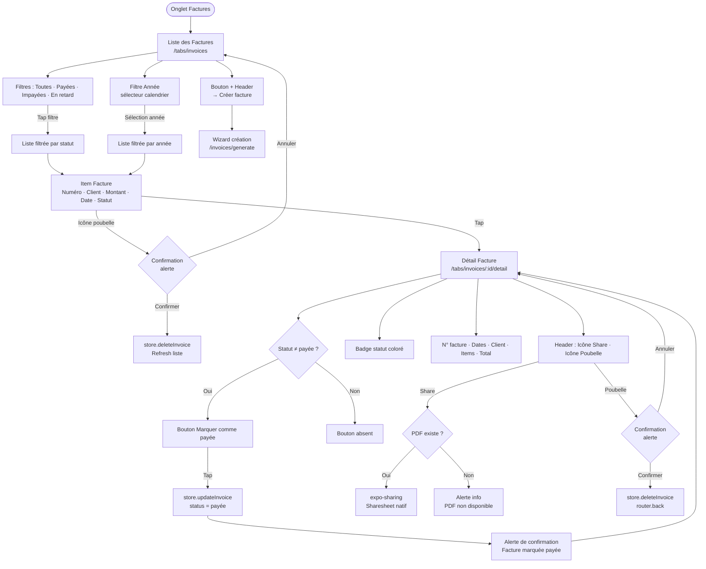

# 04 — Gestion des Factures

Fichiers : `app/(tabs)/invoices/index.tsx`, `app/(tabs)/invoices/[id]/detail.tsx`

---

## Diagramme du Flux



---

## Écran Liste des Factures

### Filtres Statut

| Filtre | Statut correspondant |
|---|---|
| Toutes | Tous |
| Payées | `'payée'` |
| Impayées | `'en attente'` |
| En retard | `'en retard'` |

### Indicateur Visuel de Statut

| Statut | Couleur |
|---|---|
| `payée` | Vert |
| `en attente` | Jaune |
| `en retard` | Rouge |
| Autre | Gris |

### Item Facture

```
┌──────────────────────────────────┐
│  #001        1 234,56 TND    🗑  │
│  Client SARL          01/07/2026 │
│  ● (badge statut coloré)         │
└──────────────────────────────────┘
```

---

## Écran Détail Facture

```
┌──────────────────────────────────┐
│  ← Retour    [📤 Share]  [🗑]   │
├──────────────────────────────────┤
│  [Badge: EN ATTENTE]             │
│  N° INV-001 0626                 │
│  Émise le : 01/07/2026           │
│  Échéance : 15/07/2026           │
├──────────────────────────────────┤
│  Client :                        │
│  Client SARL                     │
│  123 Rue de la Paix, Paris       │
│  TVA : FR12345678901             │
├──────────────────────────────────┤
│  Désignation    Qté   Prix       │
│  Développement   1    500,00     │
│  Design          2    150,00     │
├──────────────────────────────────┤
│  Total : 800,00 TND              │
├──────────────────────────────────┤
│  [Marquer comme payée]           │
└──────────────────────────────────┘
```

---

## Valeurs de Statut

> Les statuts sont stockés en français dans le store Zustand, indépendamment des constantes `InvoiceStatus` en anglais dans `constants/index.ts`.

| Valeur Store | Label UI |
|---|---|
| `'en attente'` | En attente (jaune) |
| `'payée'` | Payée (vert) |
| `'en retard'` | En retard (rouge) |

---

## Génération PDF depuis le Détail

Le PDF est généré via `app/utils/pdf.ts:generateInvoicePdf()` et stocké dans `FileSystem.documentDirectory/facture-{invoiceNumber}.pdf`. Le partage utilise `expo-sharing`.

> Si le PDF n'a pas encore été généré (facture créée en dehors du wizard), une alerte informe l'utilisateur.
