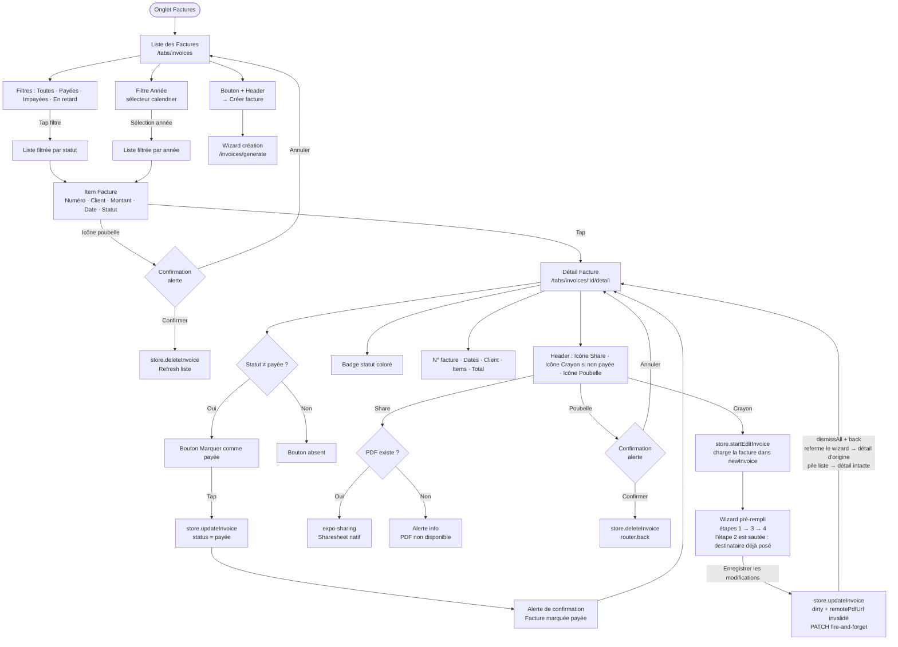

# 04 — Gestion des Factures

Fichiers : `app/(tabs)/invoices/index.tsx`, `app/(tabs)/invoices/[id]/detail.tsx`

---

## Diagramme du Flux



---

## Écran Liste des Factures

### Filtres Statut

Les filtres et l'affichage utilisent le **statut dérivé** (`getDisplayStatus` de `app/utils/invoice.ts`) : « en retard » est calculé à l'affichage (`invoiceDueDate < maintenant` et non payée) — le champ `status` stocké ne contient que `'payée' | 'en attente'`.

| Filtre | Statut dérivé correspondant |
|---|---|
| Toutes | Tous |
| Payées | `'payée'` |
| Impayées | `'en attente'` (échéance non dépassée) |
| En retard | `'en retard'` (échéance dépassée, non payée) |

### Synchronisation backend (phase 4)

- **Push** : factures `dirty` → `/invoices` au boot et à la sauvegarde du wizard. Le contact destinataire est poussé d'abord (le POST exige son ObjectId). `tag` = numéro local, conservé si unique (sinon recréation sans tag, numéro serveur adopté au pull). 403 quota → la facture reste locale (upsell phase 6).
- **« Marquer payée »** : `PATCH /invoices/:id/status` fire-and-forget.
- **Édition** : réservée aux factures **non payées** (une facture réglée est figée ; « en retard » étant dérivé, elle reste éditable). Le crayon du détail appelle `startEditInvoice()` et rouvre le wizard pré-rempli ; le destinataire n'est pas modifiable (l'étape 2 est sautée). À l'enregistrement : `updateInvoice()` (dirty), `remotePdfUrl` invalidé jusqu'au prochain push réussi (le détail régénère le PDF localement), et si le numéro a changé l'ancien `{tag}.pdf` local est supprimé. Push `PATCH /invoices/:id` via `syncInvoiceById` (404 → recréation, 409 sur le tag → numéro serveur adopté au pull).
- **Suppression** : différée à la fermeture du snackbar depuis la liste (undo sans DELETE) ; immédiate depuis le détail (pas d'undo).
- **Pull** : toutes les pages, merge par remoteId puis tag — le `dirty` local gagne.
- **PDF** : si la facture a un `remotePdfUrl` (plan avec génération PDF), le détail télécharge le PDF serveur (source de vérité) avec fallback expo-print.

### Indicateur Visuel de Statut

Couleurs partagées liste/détail (`getStatusColor`) :

| Statut dérivé | Couleur |
|---|---|
| `payée` | Vert |
| `en attente` | Jaune |
| `en retard` | Rouge |

### Item Facture

```
┌──────────────────────────────────┐
│  #001        1 234,56 TND    🗑  │
│  Client SARL          01/07/2026 │
│  ● (badge statut coloré)         │
└──────────────────────────────────┘
```

---

## Écran Détail Facture

```
┌──────────────────────────────────┐
│  ← Retour  [📤 Share] [✏️] [🗑] │
│  (✏️ absent si statut = payée)   │
├──────────────────────────────────┤
│  [Badge: EN ATTENTE]             │
│  N° INV-001 0626                 │
│  Émise le : 01/07/2026           │
│  Échéance : 15/07/2026           │
├──────────────────────────────────┤
│  Client :                        │
│  Client SARL                     │
│  123 Rue de la Paix, Paris       │
│  TVA : FR12345678901             │
├──────────────────────────────────┤
│  Désignation    Qté   Prix       │
│  Développement   1    500,00     │
│  Design          2    150,00     │
├──────────────────────────────────┤
│  Total : 800,00 TND              │
├──────────────────────────────────┤
│  [Marquer comme payée]           │
└──────────────────────────────────┘
```

---

## Valeurs de Statut

> Les statuts sont stockés en français dans le store Zustand, indépendamment des constantes `InvoiceStatus` en anglais dans `constants/index.ts`.

| Valeur Store | Label UI |
|---|---|
| `'en attente'` | En attente (jaune) |
| `'payée'` | Payée (vert) |
| `'en retard'` | En retard (rouge) |

---

## Génération PDF depuis le Détail

Le PDF est généré via `app/utils/pdf.ts:generateInvoicePdf()` et stocké dans `FileSystem.documentDirectory/{invoiceNumber}.pdf` (nom = tag de la facture, visible au partage ; les anciens `facture-*.pdf` sont purgés au boot par `purgeLegacyPdfFilenames`). Le partage utilise `expo-sharing`.

> Si le PDF n'a pas encore été généré (facture créée en dehors du wizard), une alerte informe l'utilisateur.
