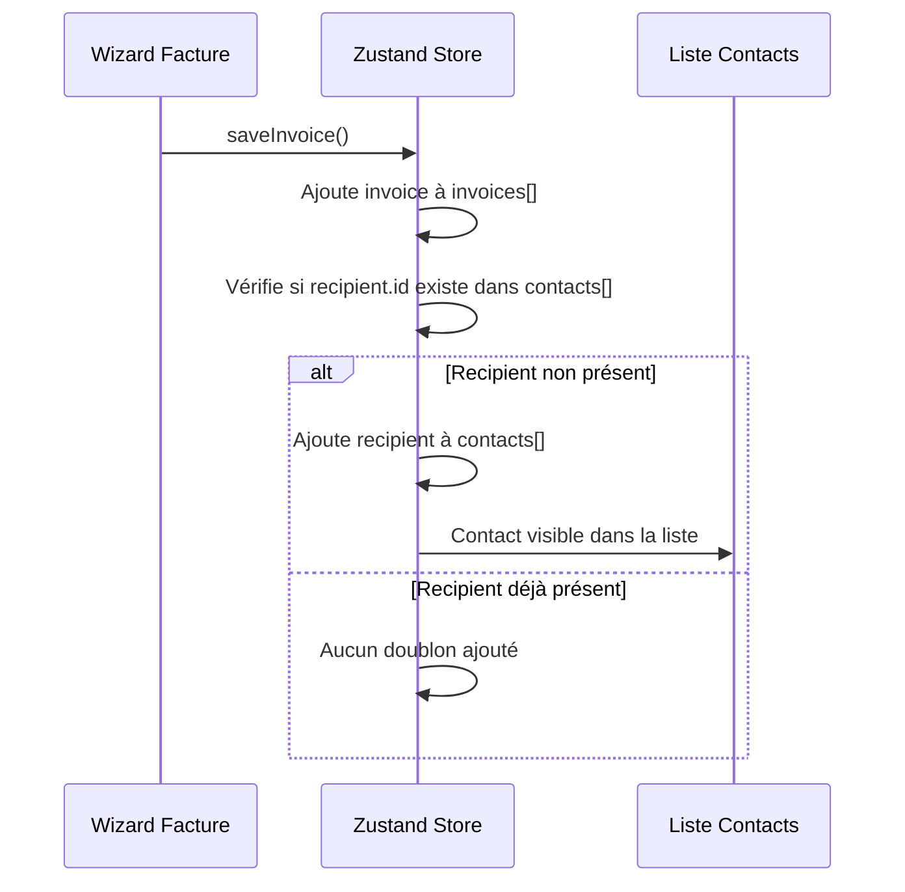

# 05 — Gestion des Contacts

Fichiers : `app/(tabs)/contacts/index.tsx`, `app/(tabs)/contacts/[id]/edit.tsx`

---

## Diagramme du Flux

```mermaid
flowchart TD
    TAB([Onglet Contacts]) --> LIST[Liste des Contacts\n/tabs/contacts]

    LIST --> SEARCH[Barre de recherche\nfiltrage temps réel par nom]
    LIST --> CONTACT_ITEMS[Items contacts\nAvatar initiales · Nom · Adresse]

    CONTACT_ITEMS -->|Appui long| CONTEXT_MENU[Menu contextuel]
    CONTACT_ITEMS -->|Swipe gauche| SWIPE_ACTIONS[Actions révélées\nCrayon · Poubelle]
    CONTEXT_MENU -->|Modifier| EDIT[/contacts/:id/edit\nFormulaire édition]
    SWIPE_ACTIONS -->|Crayon| EDIT
    CONTEXT_MENU -->|Supprimer| DEL_CONFIRM{Confirmation\nalerte}
    SWIPE_ACTIONS -->|Poubelle| DEL_CONFIRM
    DEL_CONFIRM -->|Confirmer| DELETE[store.deleteContact\nRefresh liste]
    DEL_CONFIRM -->|Annuler| LIST

    EDIT --> EDIT_FORM[Nom · Adresse · TVA · Email]
    EDIT_FORM -->|Mettre à jour| SAVE[store.updateContact\nrouter.back]
    SAVE --> LIST

    CONTACT_ITEMS -->|Icône facture verte| CREATE_INVOICE[store.startNewInvoice\nstore.addRecipientInfo\nrouter.push /invoices/generate/index]
    CREATE_INVOICE --> WIZARD_STEP1[Wizard → Étape 1\nContact pré-sélectionné\nSaute Étape 2]

    LIST -->|Liste vide| EMPTY_STATE[Message vide\n+ Bouton Créer un contact]
    EMPTY_STATE -->|Tap| NEW_CONTACT[/invoices/generate/new-contact\nFormulaire nouveau contact]

    SEARCH -->|Aucun résultat| NO_RESULTS[Aucun contact trouvé]
```

---

## Écran Liste des Contacts

```
┌──────────────────────────────────┐
│  Contacts                        │
│  🔍 Rechercher un contact...   ✕ │
├──────────────────────────────────┤
│  [AB] Ahmed Ben Ali              │
│       123 Rue Habib Bourguiba    │
│                              [📄]│  ← Bouton "Nouvelle facture"
├──────────────────────────────────┤
│  [CS] Client SARL                │
│       45 Av. Charles de Gaulle   │
│                              [📄]│
│                                  │
│                            (+)   │  ← FAB → /contacts/new
└──────────────────────────────────┘
```

**Avatar** : Deux premières lettres du nom en majuscules, fond coloré généré automatiquement.

---

## Création Manuelle (`/contacts/new`)

FAB « + » (bas droite) et CTA de l'état vide. Même formulaire que l'étape 2B du wizard (nom, adresse, n° TVA, email) mais **hors wizard** : `addContact()` + `syncContactById()` (push backend fire-and-forget) + retour à la liste. Ne pas utiliser `invoices/generate/new-contact` depuis cet onglet — il démarre une facture.

---

## Synchronisation backend (phase 3)

- **Push** : contacts `dirty` poussés vers `/recipients` (POST, ou PATCH si `remoteId`) — au boot, et après chaque création/édition d'écran. `409` (email existant, ex. créé côté front Angular) → adoption du recipient serveur via recherche par email. `404` sur PATCH → remoteId abandonné, recréation.
- **Pull** : toutes les pages (`limit=20`), merge par `remoteId` puis par email ; un contact local `dirty` gagne (il sera poussé), sinon le serveur fait foi.
- **Suppression** : DELETE distant différé à la fermeture du snackbar — un undo n'envoie jamais de suppression. Hors ligne, la suppression est **mise en file persistée** (`pendingDeletions`) et rejouée au boot + retour au premier plan jusqu'au succès (404 = déjà supprimé = succès).

---

## Création Automatique de Contact

**La fonctionnalité clé** : chaque fois qu'une facture est sauvegardée (`store.saveInvoice()`), le destinataire est automatiquement ajouté à `store.contacts[]` — sans action manuelle de l'utilisateur.



La déduplication se fait par `recipient.id` (UUID).

---

## Écran Édition Contact (`/contacts/[id]/edit`)

| Champ      | Obligatoire |
| ---------- | ----------- |
| Nom        | Oui         |
| Adresse    | Oui         |
| Numéro TVA | Non         |
| Email      | Non         |
| SIRET      | Non         |

**Action store :** `updateContact(updatedBusinessEntity)` + `router.back()`

---

## État Vide

Si `store.contacts.length === 0` :

- Message : _"Les contacts vont apparaître lorsque vous créerez des factures"_
- Bouton bleu **"+ Créer un contact"** → redirige vers `/invoices/generate/new-contact`

---

## Type `BusinessEntity` (Contact)

```typescript
{
  id: string        // UUID, généré automatiquement
  name: string      // Nom du contact / entreprise
  address: string   // Adresse complète
  tva?: string      // Numéro TVA (optionnel)
  email?: string    // Email (optionnel)
  currency?: string // Devise préférée (optionnel)
  taxRate?: number  // Taux TVA (optionnel)
}
```

> Le même type `BusinessEntity` sert pour le profil émetteur (`store.profile`) ET les contacts/destinataires.
