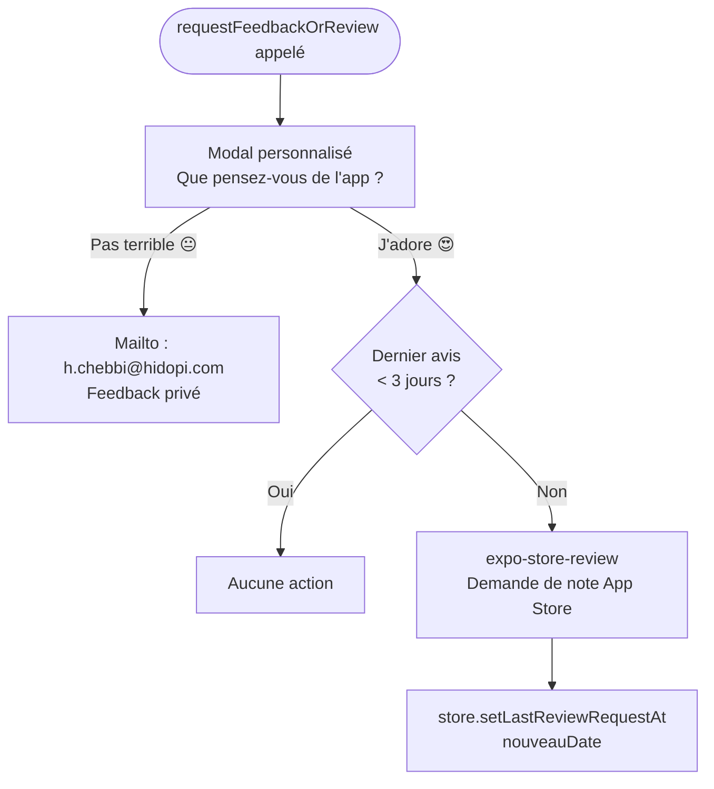

# 06 — Paramètres & Profil

Fichiers : `app/(tabs)/settings/index.tsx`, `app/(tabs)/settings/edit.tsx`, `app/(tabs)/settings/tax-currency.tsx`

---

## Diagramme du Flux

```mermaid
flowchart TD
    TAB([Onglet Paramètres]) --> MENU[Menu Paramètres\n/tabs/settings]

    MENU --> COMPANY_HEADER[En-tête : Nom de l'entreprise\ndepuis store.profile.name]

    MENU --> EDIT_PROFILE[Modifier le profil\nIcone stylo]
    MENU --> TAX_CURRENCY[Taxes & Devise\nIcone dollar]
    MENU --> RATE_APP[Évaluer l'application\nIcone étoile]
    MENU --> FEEDBACK[Envoyer un feedback\nIcone mail]
    MENU --> HELP[Centre d'aide\nIcone lien externe]
    MENU --> LOGOUT[Se déconnecter\nBouton rouge]
    MENU --> APP_VERSION[Version : 1.0.0]

    EDIT_PROFILE --> EDIT_SCREEN[/settings/edit\nÉdition Profil]
    EDIT_SCREEN --> EDIT_FORM[Nom · Adresse · N° TVA · SIRET]
    EDIT_FORM -->|Sauvegarder| SAVE_PROFILE[store.setProfile\nrouter.back]
    SAVE_PROFILE --> MENU

    TAX_CURRENCY --> TAX_SCREEN[/settings/tax-currency\nTaxes & Devise]
    TAX_SCREEN --> CURRENCY_SELECT[Sélecteur devise\nTND / EUR / USD]
    TAX_SCREEN --> TAX_INPUT[Champ taux TVA\nnumérique]
    CURRENCY_SELECT -->|Changement| UPDATE_CURRENCY[store.setProfile\nprofile.currency]
    TAX_INPUT -->|Changement| UPDATE_TAX[store.setTaxRate\nprofile.taxRate]

    RATE_APP -->|Tap| REVIEW_FLOW[requestFeedbackOrReview\nNote : Pas terrible → feedback email\nJ'adore → App Store review]

    FEEDBACK -->|Tap| FEEDBACK_EMAIL[Mailto h.chebbi@hidopi.com\nouvre client mail]

    HELP -->|Tap| EXTERNAL_LINK[Ouvre https://hidopi.com\nen navigateur externe]

    LOGOUT -->|Tap| CONFIRM_LOGOUT{Confirmation ?}
    CONFIRM_LOGOUT -->|Confirmer| DO_LOGOUT[Firebase signOut\nstore.resetNewInvoice\nrouter.replace /onbording]
    CONFIRM_LOGOUT -->|Annuler| MENU
```

---

## Menu Principal (`/tabs/settings`)

```
┌──────────────────────────────────┐
│  Mon Entreprise SARL             │  ← store.profile.name
│                                  │
│  ──────────────────────          │
│  ✏️  Modifier le profil      ›   │
│  💲  Taxes & Devise          ›   │
│  ──────────────────────          │
│  ⭐  Évaluer l'application   ›   │
│  ✉️  Envoyer un feedback     ›   │
│  ──────────────────────          │
│  🔗  Centre d'aide          ↗   │
│  ──────────────────────          │
│  Version 1.0.0                   │
│                                  │
│       [Se déconnecter]           │  ← Bouton rouge
└──────────────────────────────────┘
```

---

## Modifier le Profil (`/settings/edit`)

| Champ | Obligatoire |
|---|---|
| Nom de l'entreprise | Oui |
| Adresse | Oui |
| Numéro TVA | Non |
| SIRET | Non |

**Action :** `store.setProfile(updatedData)` + retour

---

## Taxes & Devise (`/settings/tax-currency`)

| Paramètre | Options / Type |
|---|---|
| Devise | TND (Dinar), EUR (Euro), USD (Dollar) |
| Taux TVA | Numérique (ex: 20 pour 20%) |

**Actions :** `store.setProfile({ currency })` + `store.setTaxRate(rate)`

> Ces valeurs sont utilisées dans la génération PDF et dans le récapitulatif des factures.

---

## Déconnexion

Séquence :
1. Tap "Se déconnecter"
2. Confirmation alerte (si implémentée)
3. `Firebase.auth().signOut()`
4. `store.resetNewInvoice()` — vide la facture en cours
5. `router.replace('/onbording')` — retour à l'onboarding

> L'auth-gate dans `_layout.tsx` détecte ensuite `user = null` et redirige automatiquement vers `/(auth)/login`.

---

## Système de Feedback / Avis

Fichier : `app/utils/review.ts`


