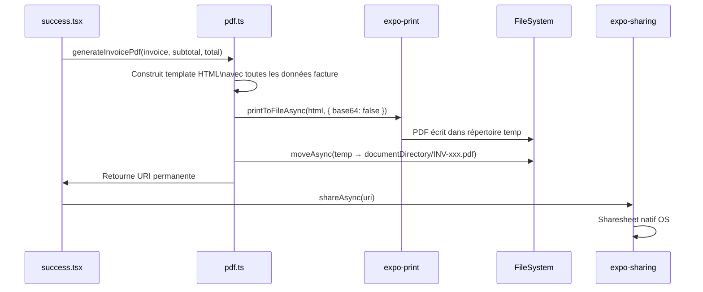

# 07 — Architecture Technique

---

## Vue d'Ensemble

```mermaid
graph TD
    UI[UI — React Native\nexpo-router + NativeWind] --> STORE[Zustand Store\nAsyncStorage]
    UI --> AUTH[Firebase Auth\nemail + Google OAuth]
    UI --> PDF[PDF Generation\nexpo-print + expo-sharing]
    UI --> ANALYTICS[vexo-analytics]

    STORE --> ASYNC[AsyncStorage\nclé: facture-store-{uid}]

    AUTH --> FIREBASE[(Firebase\nAuth SDK)]
    PDF --> FS[FileSystem\ndocumentDirectory]

    DOMAIN[Domain Layer\nREST API] --> BACKEND[(Backend\ninvoice-backend-qq9j.onrender.com)]
    AUTH -->|ID Token| DOMAIN

    style DOMAIN fill:#f9f,stroke:#999,color:#333
    style BACKEND fill:#f9f,stroke:#999,color:#333
```

> **Note** : Le Domain Layer est implémenté mais **pas encore connecté à l'UI**. L'app fonctionne en mode local-first avec Zustand.

---

## Zustand Store (`store/index.ts`)

### Schéma d'État

```
store (persiste dans AsyncStorage sous "facture-store-{uid}")
├── profile: BusinessEntity          ← Émetteur (le compte utilisateur)
│   ├── id, name, address
│   ├── tva, email
│   ├── currency ('TND' | 'EUR' | 'USD')
│   ├── taxRate (ex: 20)
│   ├── country, language
│   └── siret (optionnel)
│
├── invoices: Invoice[]              ← Toutes les factures sauvegardées
├── newInvoice: Partial<Invoice>     ← Facture en cours de création (wizard)
├── contacts: BusinessEntity[]       ← Destinataires / clients
│
├── onboardingCompleted: boolean
├── onboardingStep: 'index' | 'profile' | 'tax' | 'completed'
└── lastReviewRequestAt: Date | null
```

### Actions Principales

| Action | Rôle |
|---|---|
| `startNewInvoice()` | Initialise `newInvoice` avec le profil comme sender, génère le numéro |
| `addInvoiceInfo(data)` | Ajoute numéro, date, échéance à `newInvoice` |
| `addRecipientInfo(entity)` | Ajoute le destinataire à `newInvoice` |
| `addItems(items[])` | Ajoute les lignes de facture à `newInvoice` |
| `saveInvoice()` | Persiste `newInvoice` → `invoices[]` + auto-ajout contact |
| `resetNewInvoice()` | Vide `newInvoice` |
| `updateInvoice(invoice)` | Met à jour une facture existante (ex: statut) |
| `deleteInvoice(invoice)` | Supprime une facture |
| `setProfile(entity)` | Met à jour le profil émetteur |
| `setTaxRate(rate)` | Met à jour le taux TVA du profil |
| `setOnboardingCompleted()` | Marque l'onboarding terminé |
| `addContact(entity)` | Ajoute un contact (dédup par ID) |
| `updateContact(entity)` | Met à jour un contact |
| `deleteContact(entity)` | Supprime un contact |

---

## Types Principaux (`app/schema/invoice.ts`)

### `BusinessEntity`
```typescript
{
  id: string           // UUID v4
  name: string         // Requis
  address: string      // Requis
  tva?: string         // Numéro TVA optionnel
  email?: string
  currency?: string    // 'TND' | 'EUR' | 'USD'
  taxRate?: number     // Ex: 20
}
```

### `Invoice`
```typescript
{
  id: string
  invoiceNumber: string       // INV-001 0626
  invoiceDate: Date
  invoiceDueDate: Date
  invoiceInfo: InvoiceInfo    // Copie des dates/numéro
  sender: BusinessEntity      // Émetteur (depuis profile)
  recipient: BusinessEntity   // Destinataire
  items: InvoiceItem[]
  status: 'payée' | 'en attente' | 'en retard'
  taxRate: number
  currency: string
}
```

### `InvoiceItem`
```typescript
{
  name: string        // Désignation
  quantity: number    // Min 1
  price: number       // Prix unitaire, Min 1
}
```

---

## Génération PDF (`app/utils/pdf.ts`)



**Contenu du PDF généré :**
- Logo HidoPI + titre "Facture"
- Numéro de facture + dates
- Informations émetteur (nom, adresse, TVA)
- Informations destinataire (nom, adresse, email, TVA)
- Tableau désignations (désignation, qté, prix unitaire, total ligne)
- Totaux : sous-total, TVA (20% **hardcodé**), droit de timbre (0.99 TND), **TOTAL**
- Mentions légales (pied de page)

> Attention : Le taux TVA dans le PDF est hardcodé à 20%, indépendamment de `profile.taxRate`.

---

## Domain API (`domain/`)

Couche REST non encore connectée à l'UI. Utilise le token Firebase pour l'authentification.

| Fichier | Entité | Opérations |
|---|---|---|
| `authorization.ts` | Auth | `getAuthorization()` → Bearer token Firebase |
| `invoices.ts` | Factures | CRUD + filtres (statut, dates, email...) |
| `senders.ts` | Émetteurs | CRUD |
| `recipients.ts` | Destinataires | CRUD |
| `profile.ts` | Profil utilisateur | CRUD |

**Base URL** : `https://invoice-backend-qq9j.onrender.com/api/v1` (configurable via `EXPO_PUBLIC_API_URL`)

---

## Routing (`expo-router`)

Structure des dossiers → URLs automatiques :

```
app/
├── _layout.tsx              → Root Stack + Auth-gate
├── (auth)/                  → Groupe sans préfixe URL
│   ├── _layout.tsx
│   ├── login.tsx            → /(auth)/login
│   └── register.tsx         → /(auth)/register
├── (tabs)/                  → Groupe sans préfixe URL
│   ├── _layout.tsx          → Tab navigator (4 onglets)
│   ├── index.tsx            → / (Accueil)
│   ├── invoices/
│   │   ├── index.tsx        → /invoices (liste)
│   │   └── [id]/detail.tsx  → /invoices/:id/detail
│   ├── contacts/
│   │   ├── index.tsx        → /contacts
│   │   └── [id]/edit.tsx    → /contacts/:id/edit
│   └── settings/
│       ├── index.tsx        → /settings
│       ├── edit.tsx         → /settings/edit
│       └── tax-currency.tsx → /settings/tax-currency
├── (modals)/
│   ├── country.tsx          → /(modals)/country
│   └── language.tsx         → /(modals)/language
├── invoices/
│   ├── generate/
│   │   ├── index.tsx        → /invoices/generate
│   │   ├── contact.tsx      → /invoices/generate/contact
│   │   ├── new-contact.tsx  → /invoices/generate/new-contact
│   │   ├── items.tsx        → /invoices/generate/items
│   │   └── summary.tsx      → /invoices/generate/summary
│   └── [id]/success.tsx     → /invoices/:id/success
└── onbording/
    ├── index.tsx             → /onbording
    └── profile.tsx           → /onbording/profile
```

---

## Stack Technique

| Couche | Technologie |
|---|---|
| Framework | React Native 0.76.6 + Expo SDK 52 |
| Routing | expo-router v4 (file-based) |
| Styling | NativeWind (Tailwind CSS) |
| State | Zustand + AsyncStorage |
| Formulaires | React Hook Form + Zod |
| Auth | Firebase Auth (JS SDK) |
| PDF | expo-print + expo-sharing |
| Google Auth | expo-auth-session |
| Analytics | vexo-analytics |
| Monitoring | Sentry (@sentry/react-native) |
| Build | EAS Build (Expo Application Services) |
| Icons | Feather + FontAwesome6 |
| Animations | react-native-reanimated + Lottie |
